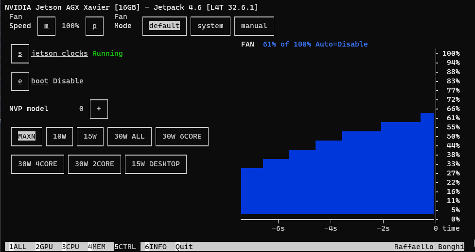

# 2 ways to control fan :
- ## jetson_clocks (change setting file)
- ## jetson-stats (easier when using terminal)

# Ok let's go
#Step 1: Install jetson-stats
## Follow this repo: 
https://rnext.it/jetson_stats/
### Running jetson-stats:

#Step2: Control the fan:
##- Change tab "5CTRL" -> Click "Default -> p"

## Enjoy!