# Requirements
Before you get started, you'll need the following:
1. SD card with storage higher 64 GB (By default, the tegraflash package for the AGX Xavier is set up for flashing the on-board eMMC.)
2. PC running Ubuntu Desktop (18.04): installed Nvidia’s SDK Manager
3. (Optional) Windows: installed SD card formatter
4. A suitable USB cable. For most Jetsons, this is a type A to micro-B cable, but for the AGX Xavier dev kit, you'll need a USB-C cable. As NVIDIA mentions in their documentation, it's important to use a good-quality cable for successful flashing. connect directly to a port on your system, rather than using a USB hub.
5. Internet Connection

# Step by Step initialization
## 1.	(Windows) Prepare the SD card and format with “SD card formatter” application on Windows.
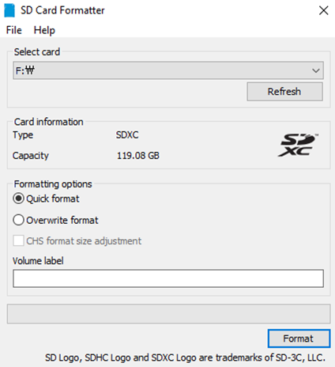
## 2.	(Ubuntu 18.04) Using a Linux PC, then run  Download the latest version of Nvidia’s SDK Manager on a PC running Ubuntu 18.04.
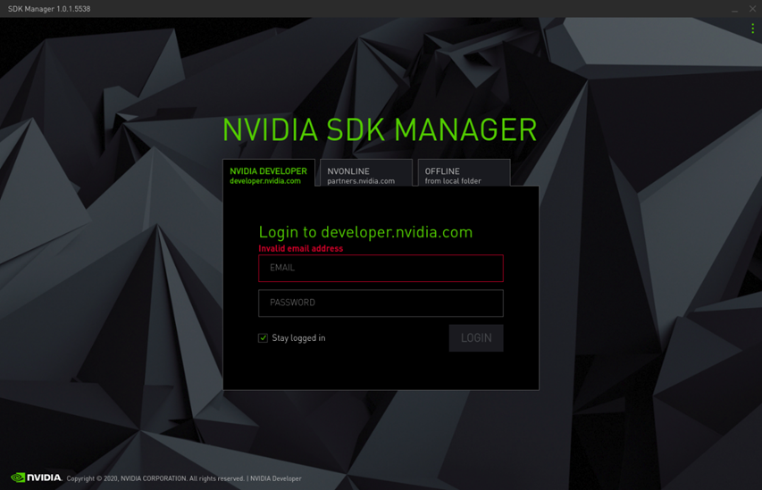
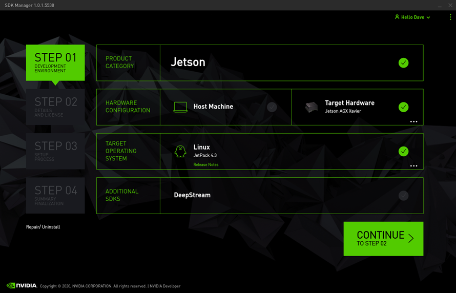
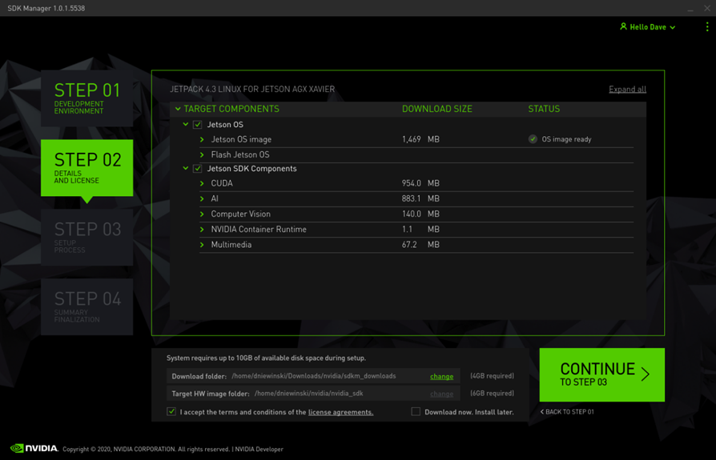
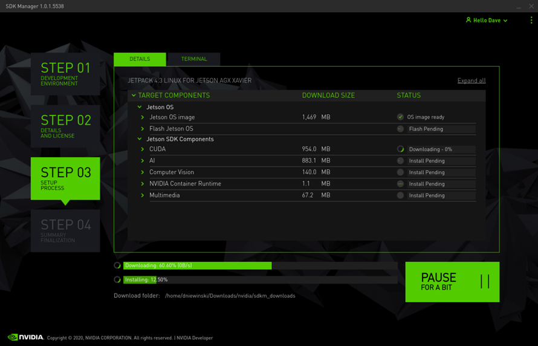
During the install, make sure to plug a keyboard and monitor into the Jetson. On first boot, it will go through the usual Ubuntu setup steps. Accept the Licenses.
## 3.	(Jetson AGX Xavier) Setup and turn on Jetson AGX Xavier:
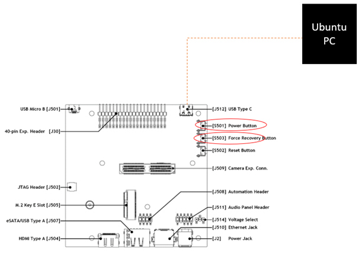
-	Connect Jetson to Ubuntu PC (currently running SDK Manager) by Cable (type C to type A).
-	Don’t forget to insert the HDMI, Mouse and Keyboard.
## 4.	(Ubuntu 18.04) Waiting the process.
- Until SDK Manager run to this screen:
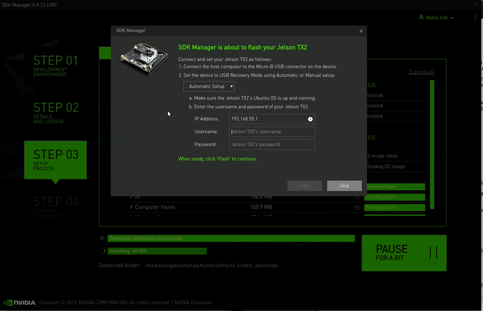
- Then change the option setting to “Manual”:
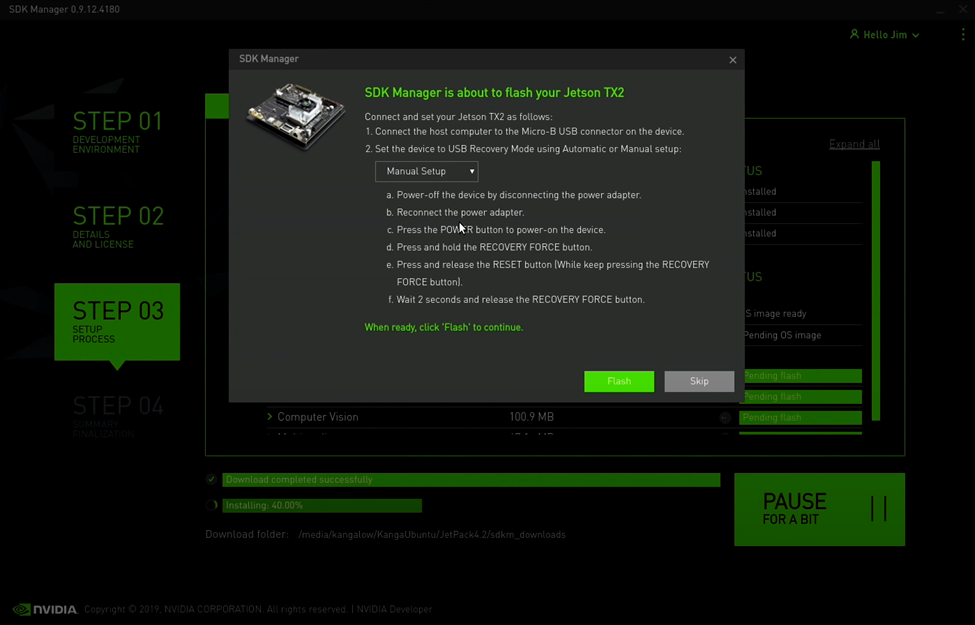
-	Remember to do **Plug in** (Cable usb type C to type A) to Ubuntu.
## 5.	(Jetson AGX Xavier): Power on the Jetson and put it into recovery mode. Holding 2 buttons to 2 seconds.
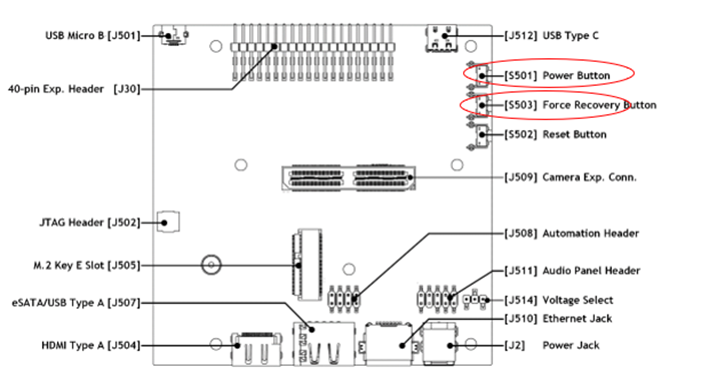
Press and hold the center button, and press and release the reset button (on the right). AGX Xavier buttons.
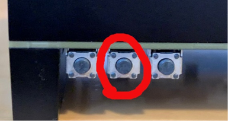
## 6.	(Ubuntu 18.04) Click the Flash
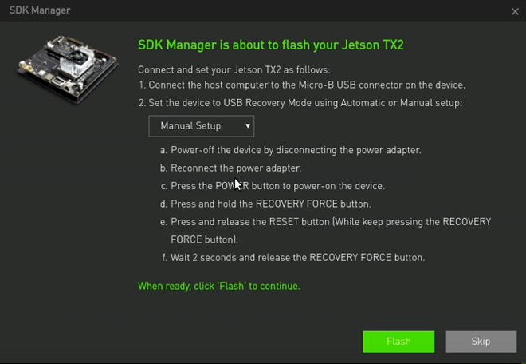
## 7.	(Jetson AGX Xavier) Setup the Username. Passwd Jetson
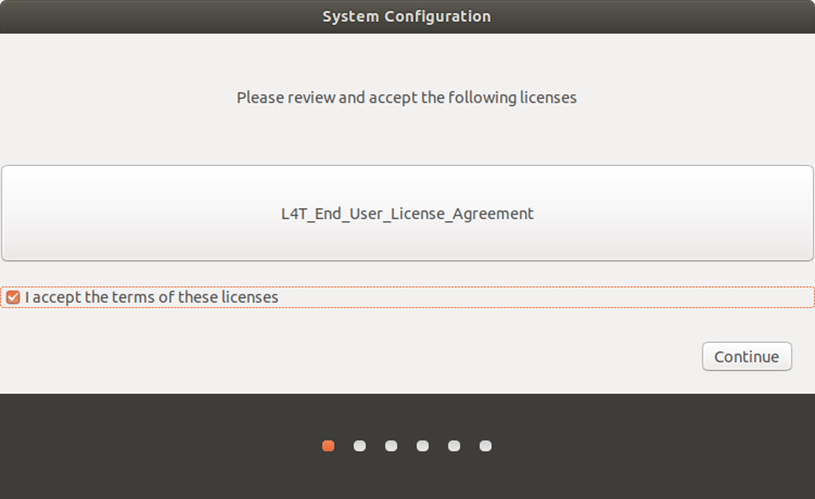
.
.
.
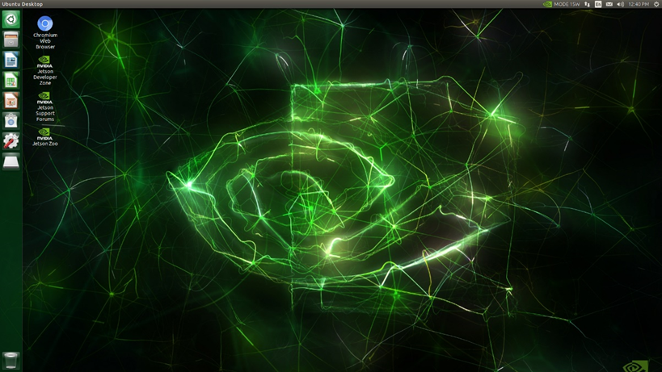
## 8.	(Jetson AGX Xavier) After initialing the OS, please insert the internet (USB internet/ Cable) and check the IP address to use next step.
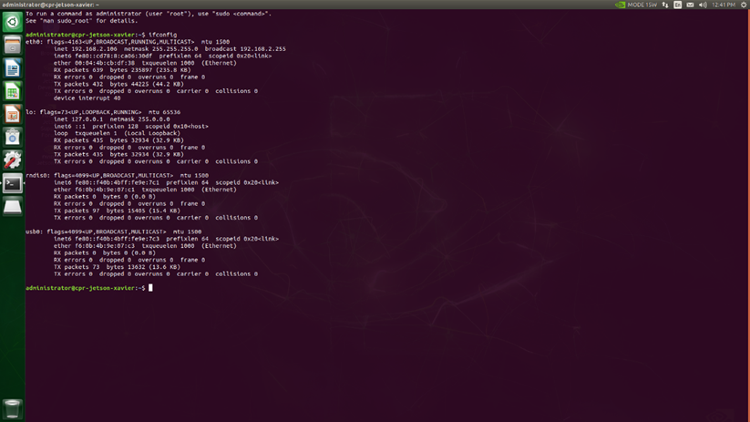

## 9.	(Ubuntu 18.04) Enter the correctly Jetson’s IP as well as username, passwd.
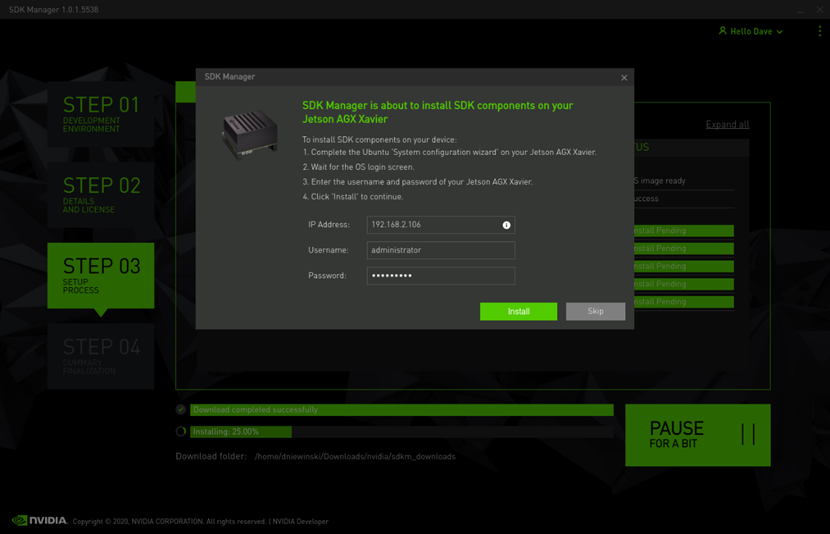
## 10.	Waiting
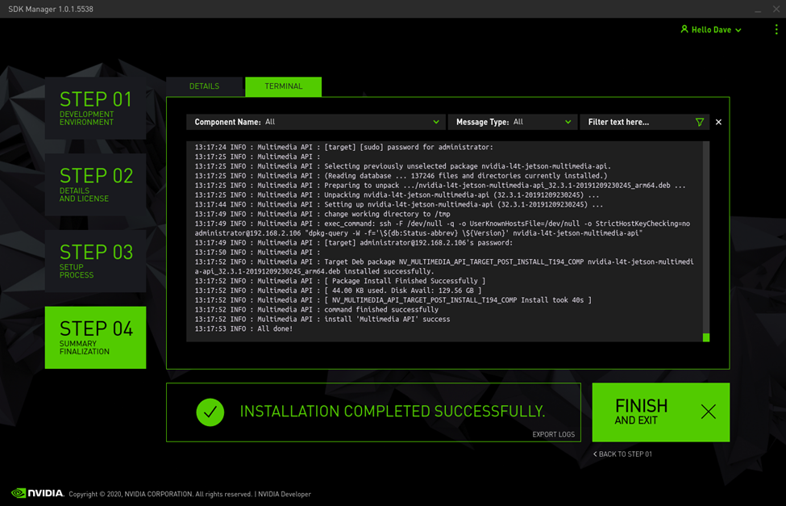