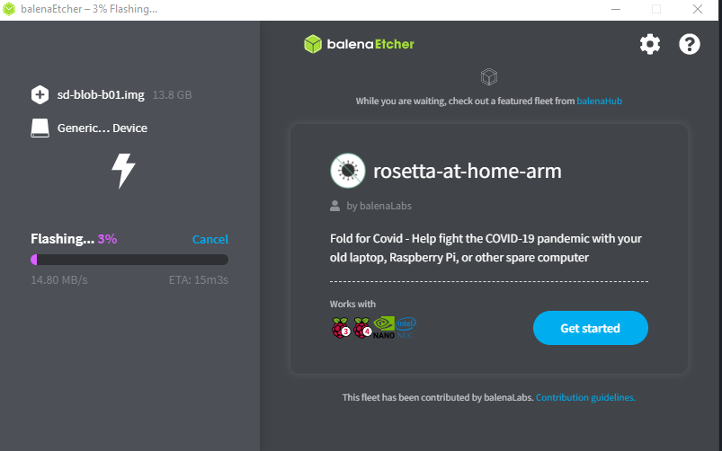

# Getting Started with Jetson Nano Developer Kit
##### All the instruction following 

[Nvidia-Jetson ](https://developer.nvidia.com/embedded/learn/get-started-jetson-nano-devkit)

# Write Image to the microSD Card
- Download the [Jetson Nano Developer Kit SD Card Image](https://developer.nvidia.com/jetson-nano-sd-card-image), and note where it was saved on the computer.
- Write the image to your microSD card by:
    + Download, install, and launch [Etcher](https://www.balena.io/etcher).
    + Click “Select drive” and choose the correct device
    
    
- Then start the Jetson Nano to First Boot

