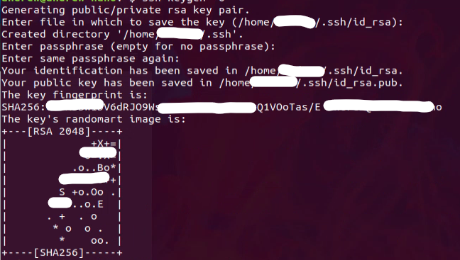
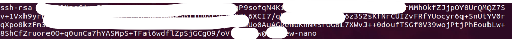
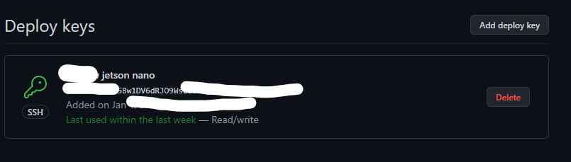

# Problem with clone code from github.com:
- Nowadays, github improves the security of project repositories. 
So we can not clone code with HTTPS without ssh-keys (registered) or using the 
**[Personal access token](https://docs.github.com/en/authentication/keeping-your-account-and-data-secure/creating-a-personal-access-token)** over HTTPS (recommended) 
- So, the best solution is manually download or <font size="+1"> <p style='color:purple'>**Deploy keys**</p> </font>
- This is the message get from clone by HTTPS:
 
```Cloning into 'Modbus-Interaction'...
Username for 'https://github.com': andrewlee1807@gmail.com
Password for 'https://andrewlee1807@gmail.com@github.com': 
remote: Support for password authentication was removed on August 13, 2021. Please use a personal access token instead.
remote: Please see https://github.blog/2020-12-15-token-authentication-requirements-for-git-operations/ for more information.
fatal: Authentication failed for 'https://github.com/andrewlee1807/Modbus-Interaction.git/'
```

# Solution: Deploy keys
1. Access to the own repository
2. Move to **Settings** tab -> **Deploy keys** -> **add deploy keys**
3. From Jetson, generate a new SSH key:
<br>On terminal run : <br>
###```ssh-keygen -o``` <br>

###```cat ~/.ssh/id_rsa.pub```

4. Copy all the keys and past to **Deploy keys**


# Clone repository
```git clone git@github.com:balena-os/jetson-flash.git```
## Enjoy!
